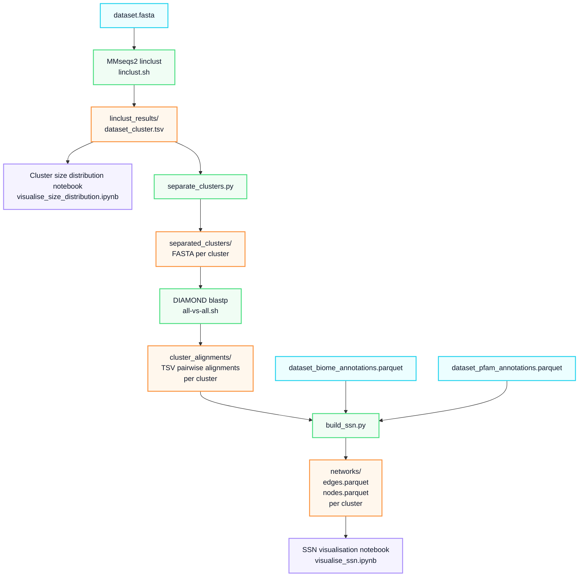

# MiSSN: A workflow for generating MGnify interactive Sequence Similarity Networks.

The [latest release](https://ebi-metagenomics.github.io/blog/2026/07/17/MGnify-Proteins-Release/) of the [MGnify Proteins Database](https://www.ebi.ac.uk/metagenomics/proteins/) contains over 5.7 billion non-redundant protein sequences, with over 1.6 billion cluster representatives including relevant metagenomics metadata. The visualisation of sets of protein sequences using Sequence Similarity Networks (SSNs) is a common approach for extracting novel insights about protein-protein relationships, including functional, structural, and evolutionary hypotheses.

To achieve this, MiSSN automates the network generation process. It uses pre-clustering to reduce sequence redundancy before computing all-vs-all pairwise alignments. The network is annotated with [*GOLD biome classifications*](https://gold.jgi.doe.gov/ecosystem_classification) and [*Pfam accessions*](https://www.ebi.ac.uk/interpro/entry/pfam/), resulting in a context-rich tool for the exploration of MGnify Proteins sequence clusters.

# Workflow


---

The pipeline consists of four major steps:

1. **Pre-clustering:** Utilizing MMseqs2 (`easy-linclust`) to perform linear-time clustering on the input dataset using **minimum sequence identity** (`-i`) and **minimum coverage** (`-c`) thresholds, reducing sequence redundancy before computing alignments.
2. **Separation:** Filtering the clustering results by a **minimum cluster size** (`-s`) and splitting the retained groups into individual FASTA files.
3. **Calculating all-vs-all alignments**: Running DIAMOND `blastp` on each separated cluster to compute all-vs-all pairwise sequence alignments, outputting the edge lists for the networks.
4. **Building the SSNs**: Filtering the edge lists by the same **minimum sequence identity** and **minimum coverage** thresholds, then enriching the network nodes with metadata—specifically *GOLD biome classifications* and *Pfam accessions*—to generate the final network edge and node Parquet files. This step calculates node colors using the **color group parts** (`-g`) parameter, which controls how many levels deep into the biome hierarchy base colors are assigned (with deeper sub-biomes inheriting shades of their parent).

> [!NOTE]
> **Why we filter twice:** MMseqs2 `easy-linclust` relies on a fast, heuristic algorithm to achieve linear-time scaling. While highly efficient for initial dataset reduction, its sequence identity and coverage boundaries are only approximate. Moreover, it only aligns sequences against their cluster representative, meaning it does not compute the all-vs-all pairwise identities required to build a complete graph. Running DIAMOND on the separated clusters calculates those missing all-vs-all connections, and applying the same thresholds again guarantees that the final network edges strictly enforce your defined parameters.

The generated SSNs can be visualised using Jupyter notebooks found under the `/notebooks` directory. We provide the following interactive environments to tune your parameters and help you analyze your data:

- **Cluster size distribution notebook** (`visualise_size_distribution.ipynb`): This notebook is designed to analyze the cluster size distribution, helping you accurately set or adjust the `<min_cluster_size>` parameter for the main pipeline.

- **SSN visualisation notebook** (`visualise_ssn.ipynb`): An interactive environment to load the generated `.parquet` network files, explore the sequence similarity networks visually, and interactively filter nodes by their biome and Pfam annotations.

# Requirements

This project manages dependencies using `conda`. The environment includes Python libraries for data processing and visualization, alongside compiled bioinformatics tools.

## Prerequisites

You will need to have [Conda](https://docs.conda.io/projects/conda/en/latest/user-guide/install/index.html) (or [Mamba](https://mamba.readthedocs.io/en/latest/installation/mamba-installation.html)) installed on your system.

## First time setup

You can easily create the required environment using the provided `environment.yml` file. Run the following commands in your terminal:

```bash
# Create the conda environment
conda env create -f environment.yml

# Activate the environment
conda activate missn
```

## Key dependencies

- Python 3.13
- Bioinformatics tools: MMseqs2, DIAMOND, Biopython
- Data processing: DuckDB, Pandas, PyArrow, NumPy
- Visualisation & UI: Cosmograph, Matplotlib, Jupyter Widgets

# Usage

Clone the repository and make sure to use an environment that fulfilles the dependencies.

```bash
git clone https://github.com/vid-szabi/MiSSN.git
cd MiSSN
```

You can run the full pipeline using the following command:

```bash
./MiSSN.sh -f <fasta_file> -b <biome_metadata_file> -p <pfam_metadata_file> -i <min_seq_id> -c <min_coverage> -s <min_cluster_size> [-o <out_dir>] [-g <color_group_parts>]
```

**Example**

This command runs the pipeline on the provided FASTA and metadata files, establishing network edges between sequences that share at least 40% sequence identity and 80% alignment coverage, and only extracting clusters that contain 5 or more members. The results will be generated under the `example_dataset/` directory.

```bash
./MiSSN.sh \
  -f example_dataset.fasta.gz \
  -b example_dataset_biome_annotations.parquet \
  -p example_dataset_pfam_annotations.parquet \
  -i 0.4 \
  -c 0.8 \
  -s 5
```

## Inputs

### Required arguments

- `-f <fasta_file>`: Path to the input protein sequence file in FASTA format (`.fasta`, `.fa`, `.faa`), supporting gzip-compressed inputs (`.gz`).

- `-b <biome_metadata_file>`: Path to the metadata file containing biome annotations, provided in Apache Parquet (`.parquet`) format.

  **Example**
  | mgyp | biome |
  | :--- | :---  |
  | MGYP007687434724 | root:Host-associated:Birds:Digestive system |
  | MGYP003341907928 | root:Environmental:Aquatic:Marine:Oceanic |

- `-p <pfam_metadata_file>`: Path to the metadata file containing Pfam accessions, provided in Apache Parquet (`.parquet`) format.

  **Example**
  | mgyp | pfam_accession |
  | :--- | :---  |
  | MGYP000084156255 | PF22721 |
  | MGYP000117404121 | PF00756 |

- `-i <min_seq_id>`: Minimum sequence identity threshold required to keep an edge between nodes in the network, specified as a decimal float from `0.0` to `1.0`.

- `-c <min_coverage>`: Minimum alignment coverage threshold required to keep an edge between nodes in the network, specified as a decimal float from `0.0` to `1.0`.

- `-s <min_cluster_size>`: Minimum number of connected members required within a component to extract and output a distinct cluster.

### Optional arguments

- `-o <out_dir>`: Custom path for the output directory where network files and reports will be saved. Defaults to a dynamically generated name based on the input FASTA filename.

- `-g <color_group_parts>`: Number of leading levels of the biome lineage to use for grouping and color-coding nodes within the network visualization. (Default: `4`).

  **Example**
  
  If set to `4`, a biome of `root:Engineered:Solid waste:Composting:Bioreactor` is is grouped under `root:Engineered:Solid waste:Composting` to determine its base color.

- `-h`: Display the help message and exit the program. 

> [!IMPORTANT]
> The input dataset must use the `.fasta`, `.fa`, or `.faa` extension. Gzip-compressed versions (e.g., `.fasta.gz`) are also supported and will be decompressed on the fly. The metadata files containing the biome and Pfam annotations must be provided in `.parquet` format.

## Outputs

The filenames are prefixed with the sequence ID of the cluster's representative member.

- `<cluster_rep>_nodes.parquet`: Contains the node attributes for the specific cluster, including the sequence IDs, biome lineage, colors (based on the biomes), and Pfam annotations.

  **Example**
  | id | biome | pfam_accession | color |
  | :--- | :--- | :--- | :--- |
  | MGYP007520866722 | root:Environmental:Terrestrial:Soil:Contaminated | PF13604 | rgb(121,216,226) |
  | MGYP001245521661 | root:Engineered:Wastewater:Activated Sludge | PF22721 | rgb(118,221,75) |

> [!NOTE]
> If a protein sequence has multiple biomes or Pfam accessions, the values are concatenated into a single string separated by semicolons, like `A;B`. We assume every sequence has at least one biome classification, but if a protein does not have any Pfam accessions, the pfam_accession value simply defaults to the string `None`.

- `<cluster_rep>_edge.parquet`: Contains the network edges between the sequences in that cluster, including sequence identity.

  **Example**
  | source | target | sequence identity |
  | :--- | :--- | :--- |
  | MGYP010172319147 | MGYP011046998155 | 77.2 |
  | MGYP000588563658 | MGYP010172319147 | 78.1 |

> [!TIP]
> These output files are formatted ready for visualization. You can load them directly into the provided `visualise_ssn.ipynb` notebook, or import them into the Cosmograph web app or Cytoscape.

# Resources

Example sequence data and metadata annotations are available in the `/dataset` directory allowing you to evaluate the pipeline immediately after installation. All provided data is derived from the MGnify Protein Database release 2026_07.

# Credits

MiSSN was originally written as a [Google Summer of Code 2026 project](https://summerofcode.withgoogle.com/programs/2026/projects/SzccYhba) by [Szabolcs Vidám](https://github.com/vid-szabi) under the mentoring of [Christian Atallah](https://github.com/chrisAta) and [Ekaterina Sakharova](https://github.com/KateSakharova).

# Citation

An extensive list of references for the tools used by the pipeline can be found in the [`CITATIONS.md`](CITATIONS.md) file.

# Licensing

All of the source code making up MiSSN in this repository is licensed under the terms of the [Apache 2.0 license](LICENSE). The example datasets provided are licensed under the terms of the [CC0 1.0 Universal (CC0 1.0) license](https://creativecommons.org/publicdomain/zero/1.0/).
